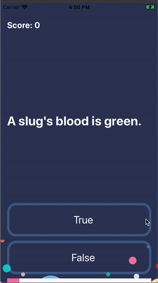

# Quizzler

## Goal

This is a test app that was created during the App Development Bootcamp. The main idea of this project is basic understanding of Model View Controller (MVC) pattern. This is a quite simple quiz game with clear design and interface that can be used for creating your own app.

## Key elements

* Using the Model-View-Controller or MVC pattern for app development.
* Using Swift Structures.

  

